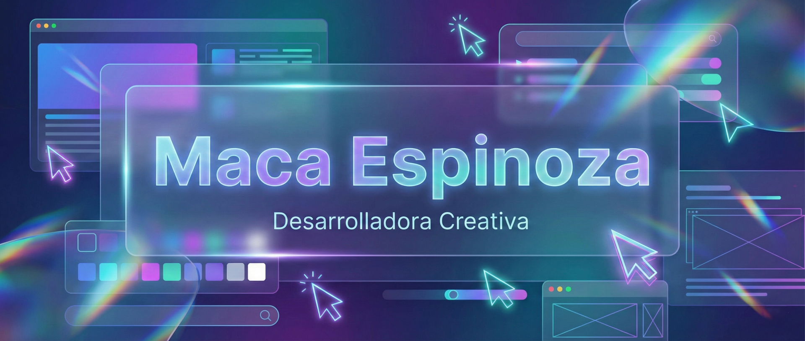

# 👋 ¡Hola! Soy Maca Espinoza 🤓

## 🚀 Sobre mí

Full Stack Developer en JavaScript con raíces en diseño multimedia y pasión por crear productos digitales que realmente conecten. Vengo del mundo del cine, la animación, motion graphics y UX/UI, así que abordo cada proyecto desde múltiples ángulos: diseño, narrativa y código trabajando juntos. Mi background multidisciplinario es lo que me hace única: años navegando entre creatividad y tecnología, y ahí es donde me siento más en mi elemento.

## 💻 Tecnologías y Herramientas

### Frontend

### Backend

### Base de Datos

### Herramientas de Desarrollo

### Diseño y Multimedia

## 📫 Contacto

## 🎓 Educación

### [Bootcamp Talento Digital: Desarrollo Full Stack en JavaScript]
*[05/2025 - 12/2025]*
- [472 horas intensivas donde aprendí a construir aplicaciones web completas: desde crear CRUDs y APIs RESTful hasta gestionar bases de datos, aplicando buenas prácticas de desarrollo que responden a estándares de la industria.]

### [Bootcamp Talento Digital: Diseño UX/UI]
*[05/2024 - 11/2024]*
- [Diseño de experiencias e interfaces centradas en usuarios reales: flujos de navegación, prototipos, investigación de usuarios, benchmarking y accesibilidad digital. (402 horas)]

## 🌱 Actualmente aprendiendo
- [Actualmente estoy aprendiendo sobre frameworks para Front End como: React, Vue, Angular y Next]
- [CSS avanzado: grid, flexbox, animaciones, transiciones, clipping, mask, etc.]

## 💡 Intereses
- [GSAP]
- [Lotties]
- [Framer Motion]
- [Three.js]
- [Spline]
- [SASS/SCSS]
- [Tailwind CSS]
- [Prisma(BDD)]

---

⭐️ Gracias por visitar mi perfil 😻 [macaespinoza](https://github.com/macaespinoza)
